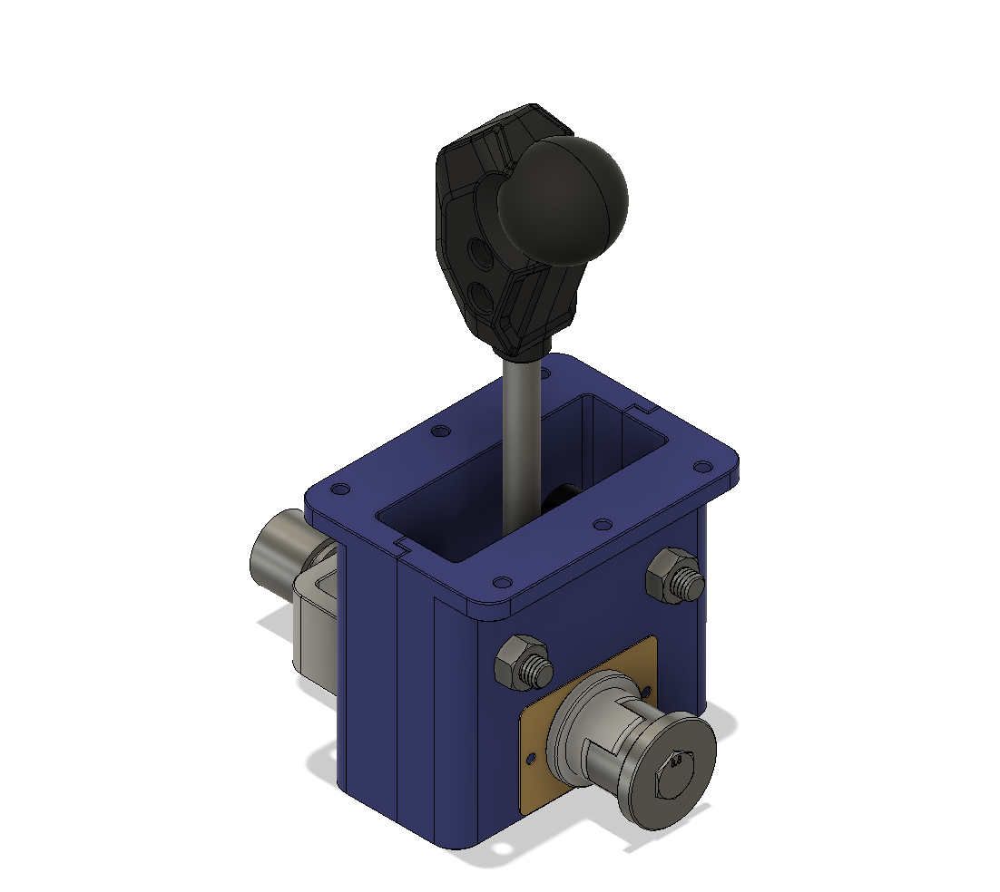

# Swing Mechanism sub-assembly (INCOMPLETE)

I've designed this to be accurate to the original design and function.

There is a STEP file provided for this assembly, you can use it as a guide or modify it to your needs.

[Photos below](#gallery)

## Required Parts

Additional custom parts and printed parts below.

| Part                                                        | Qty | Links                                                                                                                                          |
| ----------------------------------------------------------- | --- | ---------------------------------------------------------------------------------------------------------------------------------------------- |
| Rubber Tube (8mm ID, 15mm OD, 23mm Length)                  | 2   | [8x14mm \(Cheaper\)](https://www.aliexpress.com/item/1005001683018083.html) or [8x15mm](https://www.aliexpress.com/item/1005001474127393.html) |
| Compression Spring (Wire Dia. : 2mm, Len. : 80mm, OD: 30mm) | 1   | [AliExpress](https://www.aliexpress.com/item/4000436939383.html)                                                                               |
| Angle sensor 0-3.3V output                                  | 1   | [AliExpress](https://www.aliexpress.com/item/32422949989.html)                                                                                 |
| 6x8 Shaft Coupler (D:14, L:25)                              | 1   | [AliExpress](https://www.aliexpress.com/item/1005001891597730.html)                                                                            |
| 608 bearing                                                 | 2   |                                                                                                                                                |
| M8x90 Hex Bolt. **pivot rod.**                              | 1   |                                                                                                                                                |
| M8x60 Hex Bolt. **Stopper Rods.**                           | 2   |                                                                                                                                                |
| M8 nuts (use threadlocker on pivot rod)                     | 5   |                                                                                                                                                |
| M3x6 Bolt **angle sensor**                                  | 2   |                                                                                                                                                |
| M3 Countersunk Bolts(x6). (Len: 6mm + thickness of casing.) | 6   |                                                                                                                                                |
| M3x10 Bolts **Friction plate**                              | 2   |                                                                                                                                                |
| M3x16 Bolts **T-Coupler clamp**                             | 2   |                                                                                                                                                |
| M3x6 Bolts **T-Coupler Handle rod**                         | 2   |                                                                                                                                                |
| M3 Treaded Inserts                                          | 12  |                                                                                                                                                |
| M3 nuts                                                     | 2   |                                                                                                                                                |
| Grease                                                      | 1   |                                                                                                                                                |

## Printed Parts

| Parts               | Qty | Notes                        |
| ------------------- | --- | ---------------------------- |
| Knob                | 1   |                              |
| Mounts A & B        | 1   |                              |
| sensor holder       | 1   |                              |
| spring holder A & B | 1   | Recommended to print in PETG |
| T-coupler           | 1   | Recommended to print in PETG |

## Custom Parts

### Handle Rod

- 10mm Dia., 150mm Len.
- brass/steel

### Friction Plate

- Dimensions: 34x50mm
- thickness: 0.64mm
- Sheet brass/steel
- apply grease on contacting surface.

## Gallery

